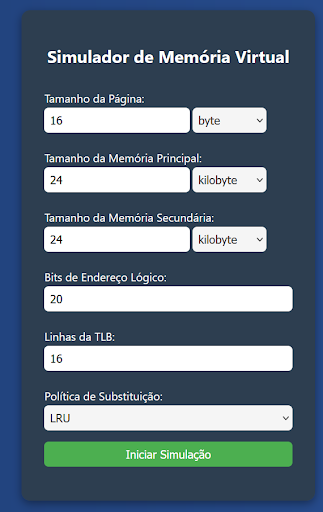
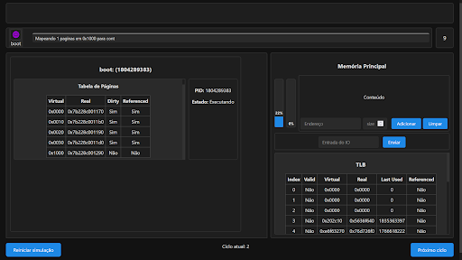
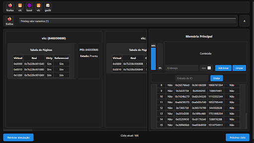

# gerenciador-memoria-virtual

UNIVERSIDADE FEDERAL FLUMINENSE

INSTITUTO DE COMPUTAÇÃO

TCC00316 - SISTEMAS OPERACIONAIS - A1

Profª. Cristina Boeres

Simulação de Gerenciador de Memória feito por:
* Ana Lívia Ribeiro
* Jade Mendes 
* Lucas Coutinho
* Mateus Regasi
* Nathan Pinheiro
* Yumi Nakashima

Junho 2025

O gerenciador de memória virtual, programado principalmente em C, simula o comportamento de um sistema operacional ao dividir processos em páginas que são carregadas para execução. A interface gráfica foi desenvolvida com HTML, CSS e JavaScript.

Ao compilar o programa usando o WSL ou um sistema operacional Linux, podemos abrir o programa, que iniciará um servidor local. Acessando um browser na porta dada, tem-se a tela inicial onde se determinam as especificações de memória da simulação.

Os valores definidos por padrão permitem uma execução normal do simulador, mas valores menores podem causar suspensão ou falta de memória, impedindo os processos de completarem sua execução.

Após iniciar a simulação, mostra-se a interface do simulador, separada em diversas seções com informações diferentes:

- A barra superior mostra a fila de processos, determinando a ordem em que serão escalonados para execução.
- A segunda barra, logo abaixo, mostra qual processo está sendo executado naquele momento. Na imagem acima, mostra o Boot executando o processo que determina quais outros processos entrarão na fila. No final desta barra, mostra a quantidade de ciclos que este processo ainda pode executar por. Se este valor acabar e o processo não tiver terminado, voltará ao fim da fila.
- A grande caixa na esquerda mostra os dados de todos os processos despachados, como o seu endereço virtual, real, seu bit “sujo” e se o dado está sendo referenciado. Clicando no endereço real, nesta tela, nos permite observar o valor contido no endereço.
- A caixa na direita contém dados, como a porcentagem de memória principal e secundária ocupadas, respectivamente, mostrada nas barras verticais. Na direita, mostra o conteúdo observado dentro dos endereços acessados, bastando clicar em “Adicionar” para copiar seu conteúdo, e “limpar” para remover o conteúdo da tela. A quantidade de bytes determina quanto do endereço será lido, mas muitas vezes pode acabar lendo “lixo”.
- Abaixo do leitor de conteúdo, há a barra de E/S (I/O). Aqui se digitam as informações que os processos pedem ao usuário, como quantos processos serão criados, quais os nomes desses processos e quantas vezes que cada processo deve executar.
- Mais abaixo há a TLB, mostrando o estado dos quadros que são preenchidos pela informação dos processos, e nos permitindo observar a política de substituição em ação. No modo LRU, por exemplo, cada quadro contém o dado “last used”, contendo o valor do ciclo em que aquele espaço foi alterado pela última vez.
- Por fim, os botões “Reiniciar simulação” e “Próximo ciclo” permitem voltar à página de especificação dos tamanhos para reiniciar o simulador, ou seguir para o ciclo seguinte da simulação atual.

Nesta imagem, o processo “firefox” está executando e printando o valor numérico “1” na tela. Ele executará por mais 4 ciclos antes de voltar ao fim da fila, e outro processo “firefox” tomará seu lugar, depois o processo “vlc”, e assim por diante.
