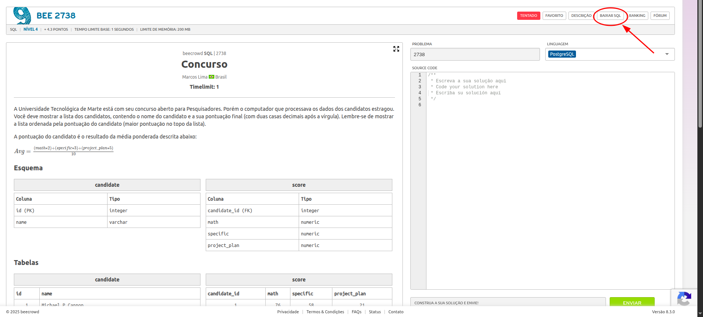

# Como fazer esses exercícios?

Todos esses exercícios estão linkados a uma questão do beecrowd. Eles estão separados por bloco de assunto:

1. Projeção, seleção e aliases.
2. Operações de conjunto, operadores existenciais e campos vazios.
3. Junção.
4. Agrupamento e ordenação.

## Algumas observações:

1. Os exercícios, no beecrowd estão em PostgreeSQL, que tem uma sintaxe diferente de MySQL. 
2. Portanto não foque em seu exercício passar no beecrowd! Foque em testar o comportamento em seu computador!
3. Você pode baixar o esquema de teste acessando a página do exercício do beecrowd e apertando em BAIXAR SQL como mostra a imagem abaixo.

